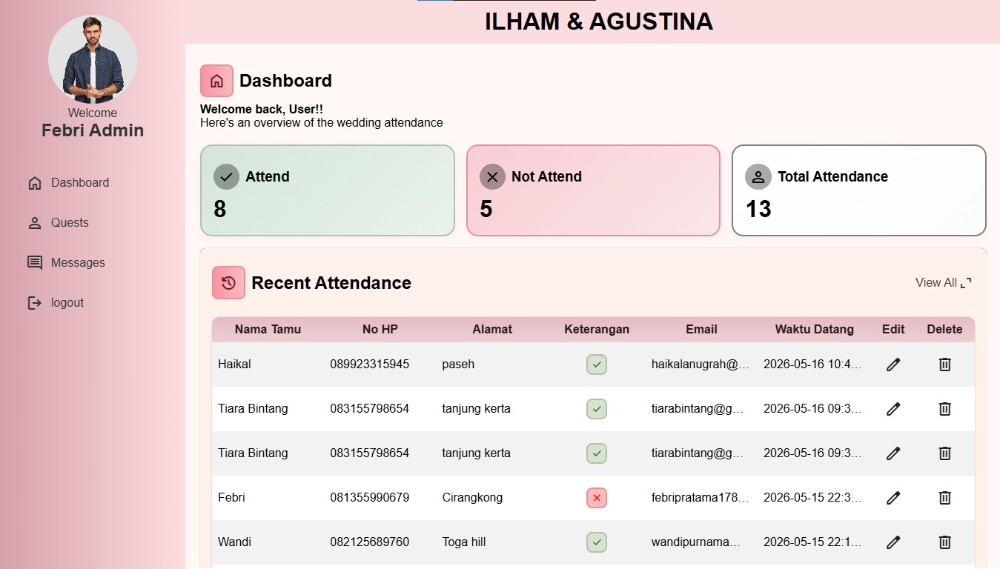
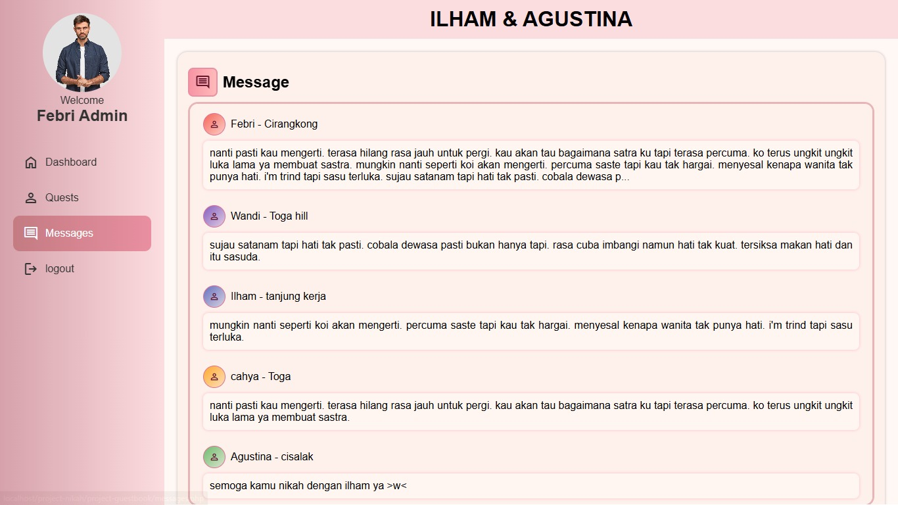

# project-wedding
Project Wedding adalah aplikasi berbasis web yang dirancang untuk memantau kehadiran tamu dan petugas pada acara pernikahan secara terpusat. Selain pencatatan kehadiran, aplikasi ini menyediakan fitur buku tamu digital interaktif di mana para undangan dapat mengirimkan pesan dan doa restu secara langsung kepada kedua mempelai.

## ✨ Fitur Utama

- **Modern & Elegant UI:** Tampilan *dashboard* yang rapi menggunakan implementasi CSS *linear-gradient* dan sentuhan *glassmorphism*.
- **Real-time Live Search:** Admin dapat mencari nama tamu secara instan tanpa perlu memuat ulang halaman (*reload*), dibangun murni dengan Vanilla JavaScript.
- **Dynamic Avatar Profiles:** Ikon profil tamu akan secara otomatis menghasilkan warna *background gradient* (Material Design Color) yang unik berdasarkan huruf awal nama tamu menggunakan data JSON.
- **Attendance Management:** Melacak status kehadiran tamu (Hadir / Tidak Hadir) beserta ucapan doa yang diberikan secara langsung.
- **Responsive Layout:** Antarmuka yang menyesuaikan dengan baik untuk kemudahan pemantauan.

## 🛠️ Teknologi yang Digunakan 
- **Frontend:** HHTML5, CSS3, Vanilla JavaScript (ES6)
- **Backend:** PHP Native, MySQL
- **UI/UX:** Google Material Icons, SweetAlert2, AOS (Animate On Scroll)
- **Environment:** Laragon / Localhost.

## 📸 Tangkapan Layar

*(Tambahkan gambar screenshot aplikasi di sini)*

> *Tampilan Dashboard Utama.*

> *Tampilan daftar tamu dengan fitur Live Search dan Avatar Dinamis.*

## 👨‍💻 Tim Pengembang (Developers)
Proyek ini dikembangkan oleh:
- Febri
- Satria
- Adit
- Cahya
- Nanda
- Aldian

---
*Dibuat dengan ❤️ untuk momen yang tak terlupakan.*
